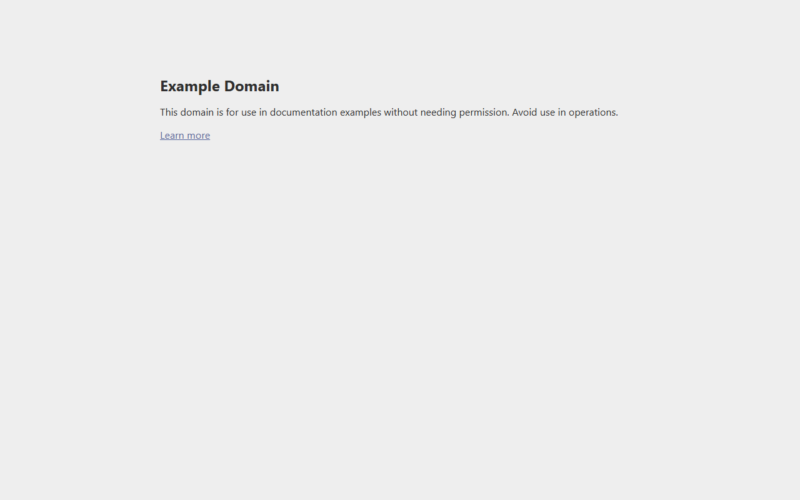
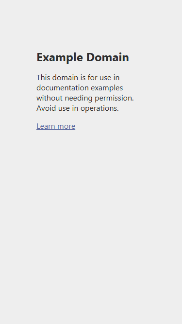

# 🔍 Website Audit Report: example.com

**Audit Date:** 2026-04-11
**Target URL:** https://example.com
**Pages Audited:** 1

---

## 📋 Executive Summary

| Severity | Count |
|----------|-------|
| 🔴 High | 0 |
| 🟡 Medium | 0 |
| 🟢 Low | 0 |
| **Total** | **0** |

## 🚀 Lighthouse Scores

| Page | Performance | Accessibility | SEO |
|------|-------------|---------------|-----|
| homepage | 🟢 98 | 🟢 100 | 🟡 80 |

## 📄 Page Breakdown

### homepage

**URL:** https://example.com

**Scores:** Performance: 98/100 | Accessibility: 100/100 | SEO: 80/100

#### Desktop

#### Mobile

---

---
*Generated by AuditLab on 2026-04-11*